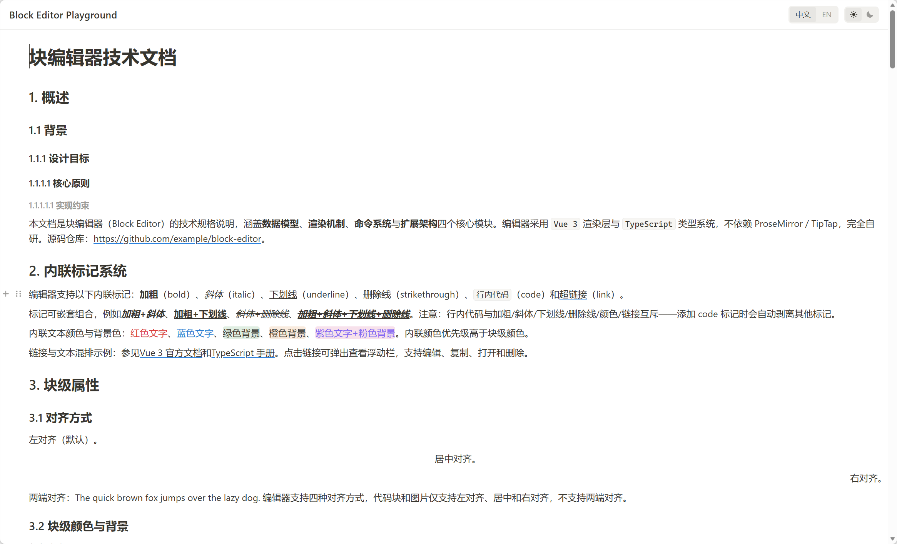

# Xiaodao Editor

[中文](./README.ZH.md) | **English**

[](https://www.npmjs.com/package/xiaodao-editor)
[](LICENSE)
[](https://vuejs.org/)
[](https://www.typescriptlang.org/)
[](https://vitejs.dev/)

Notion-style **block editor** for Vue 3 + TypeScript. Ships as a single
zero-runtime-dependency package: a framework-agnostic core plus a Vue view
layer. Every block type (paragraph, heading, list, code, …) is contributed
by an **extension**, so the core never switches on a block type.



## Features

- **11 built-in block types** — paragraph, h1–h6 (heading), bullet list,
  ordered list, to-do, quote, code block, **image**, **divider**,
  **table**, **table of contents** (13 extensions total including Keymap
  and History behavior extensions)
- **Table block** — `attrs`-based N×M grid; default 120 px column widths,
  new tables default to header row; row/column selection strips,
  corner-handle to select the whole table; insert dots between rows/cols;
  floating action bar with merge/split cells, **toggle header row** (sets
  `attrs.headerRow`), and delete row/col/table; each cell uses its own
  `contenteditable` with paragraph/heading/codeBlock cell types, rich
  inline marks, cell background color, and alignment; Tab navigates
  between cells, Enter exits edit (code-block cells: Enter inserts a
  newline), Escape blurs; internal horizontal scrollbar à la Arco Design;
  full-rect merge-cell selection expansion so you can never select half
  of a merged cell.
- **Inline marks** — bold, italic, underline, strikethrough, inline code,
  **link** (`Mod-K`, URL pasting, auto-link, popover with view/edit/copy/remove,
  href sanitization to block `javascript:` / XSS), per-selection text color
  and background color
- **Block-level attrs** — alignment (left/center/right/justify), text color,
  background color, indentation (0–10); image additionally carries
  `src`, `alt`, `title`, `width`, `height`, `caption`, `fileId`
- **Slash menu** — `/` opens a searchable command palette; input rules
  (`# `, `> `, `[] `, ``` ``` ````) convert blocks on the fly; `/image`
  opens the file picker
- **Block manipulation** — drag handle, hover toolbar, `+` insert button,
  grip menu with duplicate / copy / cut / move up / move down / delete;
  **real nesting** (Tab/Shift-Tab indent/outdent builds a parent–child tree;
  drag-and-drop supports before/after sibling insert plus a **drop-into**
  mode — pause over a block's center to nest under it as its first child);
  duplicate clones the whole subtree; image additionally exposes replace /
  remove / drag-resize corner handle with locked aspect ratio and editable
  caption
- **Fixed toolbar** — persistent action bar with a contextual
  **HoverToolbar** embedded inline (so text selection is preserved when
  clicking formatting buttons). Supports three placement modes via the
  `toolbarPosition` prop: `'auto'` (default — top on desktop, bottom on
  mobile), `'top'` (always top), or `'bottom'` (always bottom). Menus
  (PlusMenu / BlockSettingsMenu) open downward when the toolbar is at
  the top.
- **Sizing & internal scrolling** — constrain the editor with `width`
  and `height` props (numbers are treated as pixels). The content area
  scrolls vertically inside the editor instead of growing unbounded,
  so embedding layouts stay in control of overflow.
- **Clipboard** — clean copy/cut/paste of HTML and plain text; multi-block
  selection overlay; **HTML `` / image-file paste + drag-and-drop
  automatically create image blocks** and dispatch the upload; selecting text
  and pasting a URL wraps it as a link
- **Mobile support** — long-press to start text selection, then drag your
  finger to select **across multiple independent `contenteditable` blocks**
  via a hit-tested overlay (the native Selection API cannot cross block
  boundaries). The fixed toolbar auto-drops to the bottom above the virtual
  keyboard.
- **History** — undo/redo with typing grouping (`Mod-Z` / `Mod-Shift-Z`);
  undo restores blocks but never resurrects transient upload state
- **i18n** — `zh-CN` (default) and `en-US` via the `locale` prop; zero-dep
  translation module (no `vue-i18n`)
- **Theming** — `light` (default) and `dark` via the `theme` prop; CSS
  variables for all design tokens
- **Accessible** — keyboard navigation throughout, ARIA roles on menus
- **Table of contents** — a live, non-editable block that renders a
  hierarchical list of every heading in the document; stays in sync as
  headings are added, removed, or edited; click an entry to jump to the
  heading; insert via slash menu `/table of contents`
- **Markdown import / export** — the `Editor` instance exposes
  `toMarkdown()` and `setDocFromMarkdown(string)`. Round-trips are
  implemented natively on top of the live `DocState` (no intermediate
  `BlockData` or external converter), so heading/list nesting, inline
  code marks, and blank-line separation stay stable.

## Quick start

```sh
npm install xiaodao-editor
# or: pnpm add xiaodao-editor
```

```vue
<script setup lang="ts">
import { ref } from 'vue'
import { BlockEditor } from 'xiaodao-editor'
import type { DocumentData } from 'xiaodao-editor'
import 'xiaodao-editor/style.css'

const doc = ref<DocumentData>({ blocks: [] })
</script>

<template>
  <BlockEditor v-model="doc" />
</template>
```

The editor ships with all 13 built-in extensions by default — no need to pass
`extensions` unless you want a custom set.

## Props

| Prop              | Type                                   | Default            | Description                                                                   |
| ----------------- | -------------------------------------- | ------------------ | ----------------------------------------------------------------------------- |
| `modelValue`      | `DocumentData`                         | `{ blocks: [] }`   | The document JSON (two-way via `v-model`).                                    |
| `extensions`      | `readonly Extension[]`                 | `BuiltinExtensions`| Extensions to register. Override to add custom blocks or strip built-ins.     |
| `editable`        | `boolean`                              | `true`             | Read-only mode when `false`.                                                  |
| `placeholder`     | `string`                               | locale-aware       | Placeholder for the first empty block. Defaults to a localized string.        |
| `theme`           | `'light' \| 'dark'`                    | `'light'`          | Color theme. The class is applied to `.block-editor` and synced to `<body>`.  |
| `locale`          | `'zh-CN' \| 'en-US'`                   | `'zh-CN'`          | UI language. Any non-empty value other than `'zh-CN'` ⇒ `'en-US'`.            |
| `uploadImage`     | `UploadImageHandler`                   | in-memory mock     | Hook for image uploads. Signature: `(name, file, controller, onProgress) => Promise<ImageUploadResult>`. Consumers **must** provide this if they intend to persist documents (the default mock stores `blob:` URLs which are not serialisable). |
| `width`           | `string \| number`                     | `undefined`        | Optional fixed width. A number is interpreted as CSS pixels; a string is used as-is (e.g. `'800px'`, `'100%'`). When unset, the editor fills its container (`width: 100%`). |
| `height`          | `string \| number`                     | `undefined`        | Optional fixed height. When set, the editor scrolls its content area **internally** rather than growing unbounded; when unset the editor grows with content and the host page scrolls. |
| `toolbarPosition` | `'auto' \| 'top' \| 'bottom'`          | `'auto'`           | Placement of the persistent `FixedToolbar`. `'auto'` = top on desktop, bottom on mobile (above the virtual keyboard). |

### Emits

| Event                    | Payload        | When                                                                                  |
| ------------------------ | -------------- | ------------------------------------------------------------------------------------- |
| `update:modelValue`      | `DocumentData` | Document changed (debounced on blur).                                                 |
| `cleanup:image-file`     | `number`       | `fileId` reference count dropped to 0 (last image block referencing it was removed or its src replaced). Payload is the `fileId`; 0 is never emitted. Consumer may reclaim cloud storage.

### Expose

| Member   | Type     | Description                                                                                                                                          |
| -------- | -------- | ---------------------------------------------------------------------------------------------------------------------------------------------------- |
| `editor` | `Editor` | The framework-agnostic `Editor` instance. Useful methods: <br>`toData(): DocumentData` — export JSON. <br>`setDocument(json: DocumentData)` — replace JSON. <br>`toMarkdown(): string` — export native Markdown. <br>`setDocFromMarkdown(md: string)` — import native Markdown (resets history). |

## Theming

All design tokens are CSS variables. Light values live under `:root`; dark
values are defined on `.block-editor.theme-dark` and `body.theme-dark` (the
latter so `<Teleport>`-ed popovers inherit them too).

```css
/* Override tokens in your app */
:root {
  --be-accent: #6366f1;
  --be-radius: 4px;
}
```

The `.block-editor` element intentionally has **no background** — the host
page controls the editor's background so it blends into the surrounding UI.
Set it explicitly if needed:

```css
.block-editor {
  background: var(--be-bg); /* or any color you want */
}
```

## Built-in extensions

`BuiltinExtensions` bundles these **13 extensions** (11 block types + 2 behavior extensions):

| Extension             | Block type      | Notes                                                            |
| --------------------- | --------------- | ---------------------------------------------------------------- |
| `ParagraphExtension`  | `paragraph`     | Default block type.                                              |
| `HeadingExtension`    | `heading`       | h1–h6 via `attrs.level` (1–6).                                   |
| `BulletListExtension` | `bulletList`    | Unordered list.                                                  |
| `OrderedListExtension`| `orderedList`   | Auto-numbered; `attrs.startNumber` for explicit override.        |
| `TodoListExtension`   | `todoList`      | Checkbox via `attrs.checked`.                                    |
| `QuoteExtension`      | `quote`         | Blockquote. No inline italic (disabled by schema).               |
| `CodeBlockExtension`  | `codeBlock`     | `attrs.language`; isolating — Enter inserts a newline.           |
| `ImageExtension`      | `image`         | `content: 'none'`; attrs `src/alt/title/width/height/caption/fileId`; serialize → HTML `<figure>`/`` + Markdown ``; replace + drag-resize handle + editable caption; upload side-channel via `uploadImage` prop + `cleanup:image-file`. |
| `TableExtension`      | `table`         | `content: 'none'`; attrs `rows/cols/cells/colWidths/headerRow`; cell InlineSeq per cell with cellType/align/bgColor/rowspan/colspan; row/col selection strips + corner handle; floating toolbar with merge/split, **toggle header row**, delete row/col/table; row/col insert dots; full-rect selection expansion for merged cells. Default column width 120 px; new tables default to `headerRow: true`. |
| `DividerExtension`    | `divider`       | Isolating horizontal rule.                                       |
| `TableOfContentsExtension` | `tableOfContents` | `content: 'none'`; empty attrs — the heading list is a **dynamic view** computed from the editor state on every render. Non-editable block (`editable: false`); collects all `heading` blocks in document order (table-cell headings excluded automatically); click an entry to scroll the heading into view. Serialize emits empty string (the real headings are exported by their own blocks). |
| `KeymapExtension`     | —               | Enter / Backspace / ArrowUp / ArrowDown bindings.                |
| `HistoryExtension`    | —               | `Mod-Z` / `Mod-Shift-Z` / `Mod-Y` undo/redo keymap.              |

To use a **custom subset**, pass `extensions` explicitly:

```ts
import {
  ParagraphExtension, HeadingExtension,
  KeymapExtension, HistoryExtension,
} from 'xiaodao-editor'

const extensions = [
  ParagraphExtension, HeadingExtension,
  KeymapExtension, HistoryExtension,
]
```

## Document model

```ts
interface Block {
  id: BlockId
  type: BlockType
  attrs: Attrs              // e.g. { level: 2, align: 'center', color: 'red' }
  content: InlineSeq        // text runs with optional marks
  children: BlockId[]       // child block ids — real nesting:
                            // paragraph/heading + the 3 list kinds can be parents;
                            // any block type can be a child. `attrs.indent` is a
                            // derived mirror of the nesting depth.
}

interface DocumentData {
  id?: string
  blocks: BlockData[]       // nested JSON; normalized on import
}
```

Example document:

```ts
const doc: DocumentData = {
  blocks: [
    { type: 'heading', attrs: { level: 1 }, content: [{ type: 'text', text: 'Title' }] },
    { type: 'paragraph', content: [
      { type: 'text', text: 'Normal ' },
      { type: 'text', text: 'bold', marks: [{ type: 'bold' }] },
      { type: 'text', text: ' and a ' },
      { type: 'text', text: 'link', marks: [{ type: 'link', attrs: { href: 'https://example.com' } }] },
      { type: 'text', text: '.' },
    ]},
    { type: 'codeBlock', attrs: { language: 'ts' }, content: [{ type: 'text', text: 'const x = 1' }] },
    { type: 'image', attrs: {
        src: 'https://cdn.example.com/hero.png', alt: 'Hero',
        width: 1200, height: 630, caption: 'Fig. 1 — Architecture overview', fileId: 42,
      }, content: [] },
    { type: 'divider' },
    { type: 'table', attrs: {
        rows: 2, cols: 3,
        headerRow: true,
        colWidths: [120, 120, 120],
        cells: [
          [{ content: [{ type: 'text', text: 'A' }], rowspan: 1, colspan: 1, covered: false },
           { content: [{ type: 'text', text: 'B' }], rowspan: 1, colspan: 1, covered: false },
           { content: [{ type: 'text', text: 'C' }], rowspan: 1, colspan: 1, covered: false }],
          [{ content: [{ type: 'text', text: '1' }], rowspan: 1, colspan: 1, covered: false },
           { content: [{ type: 'text', text: '2' }], rowspan: 1, colspan: 1, covered: false },
           { content: [{ type: 'text', text: '3' }], rowspan: 1, colspan: 1, covered: false }],
        ],
      }, content: [] },
  ],
}
```

## Custom extensions

A block-type extension provides a `name`, a `schema` (block type, content kind,
and attrs with defaults + validators), and a `renderer` (a Vue component that
receives `block` and `placeholder` props). Extensions can also contribute
input rules, slash commands, keymap bindings, and Markdown/HTML
serialization. A minimal block-type extension provides a schema and a Vue
renderer:

```ts
import { defineComponent, h } from 'vue'
import type { Extension } from 'xiaodao-editor'
import { BlockContent } from 'xiaodao-editor'

const CalloutBlock = defineComponent({
  props: ['block', 'placeholder'],
  setup(props) {
    return () => h(BlockContent, {
      block: props.block,
      placeholder: props.placeholder,
      class: 'block-callout',
    })
  },
})

export const CalloutExtension: Extension = {
  name: 'callout',
  schema: {
    type: 'callout',
    content: 'text',
    attrs: {
      color: { default: 'default' },
      bgColor: { default: 'yellow' },
    },
  },
  renderer: { component: CalloutBlock },
}
```

Register it alongside the built-ins:

```ts
import { BuiltinExtensions, BlockEditor } from 'xiaodao-editor'
import { CalloutExtension } from './callout'

const extensions = [...BuiltinExtensions, CalloutExtension]
```

## Architecture

- **`src/core/`** — framework-agnostic engine (zero Vue imports, enforced by
  ESLint). Owns the document model, transactions, history, commands, schema,
  extension registries, and **native Markdown import/export**
  (`Editor.toMarkdown()` / `Editor.setDocFromMarkdown()` — operates straight
  on `DocState`, no intermediate `BlockData`).
- **`src/view/`** — Vue bridge: `BlockEditor.vue` (root), `BlockList`,
  `BlockHost`, `BlockContent` (per-block `contenteditable`), and the UI
  components (`BlockHandle`, `BlockSettingsMenu`, `HoverToolbar`, `PlusMenu`,
  `OrderedListMenu`, `NumberPicker`, `CodeLangPicker`, `LinkPopover`,
  `FixedToolbar`).
- **`src/extensions/`** — the 13 built-in extensions plus `_commonAttrs.ts`
  (shared align/color/bgColor/indent specs and color presets, plus
  `ImageExtension`'s upload-side-channel renderer logic). **Table** lives in
  `Table.ts` (Vue renderer + command registrations) and `tableModel.ts` (pure
  structural helpers: insert/remove row/col, merge/split cells, full-rect
  selection expansion, header row toggle, column width helpers, HTML/Markdown
  serialization, attrs validation/coercion). **Divider** lives in `Divider.ts`.
  **Table of contents** lives in `TableOfContents.ts` (non-editable block that
  renders a live heading list).
- **`src/i18n.ts`** — locale + theme module; provides `t(key)` via Vue's
  provide/inject so popovers rendered through `<Teleport>` stay reactive.

## Development

```bash
pnpm install
pnpm dev          # playground at http://localhost:5173
pnpm typecheck    # vue-tsc --noEmit
pnpm build        # vue-tsc --noEmit && vite build  → library dist/
pnpm build:demo   # vue-tsc --noEmit && vite build --mode demo  → demo dist-demo/ (playground/App.vue)
pnpm lint         # eslint --fix
```

## License

MIT
